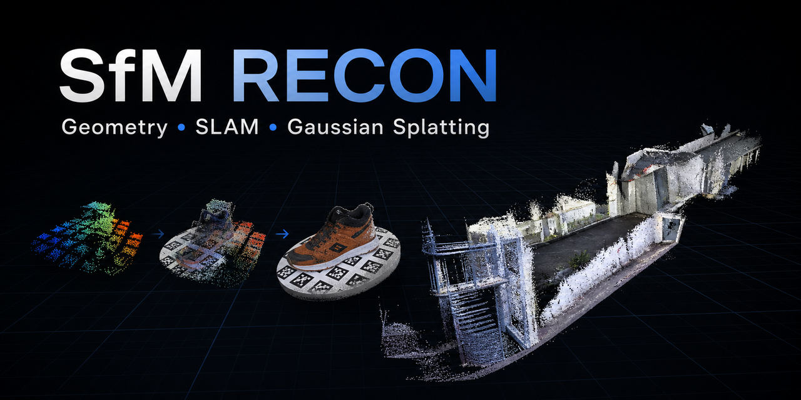
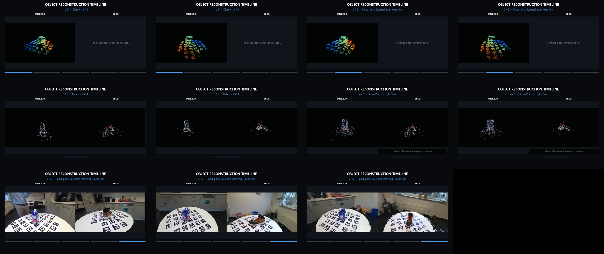
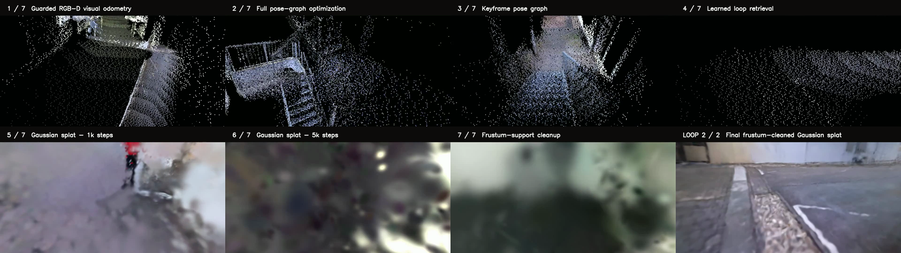
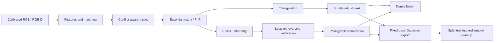

# SfM Recon: Geometry to Gaussian Splatting

[](https://github.com/humma-humma/sfm_recon/actions/workflows/ci.yml)
[](https://www.python.org/)
[](LICENSE)
[](tests)



A from-scratch, calibrated 3D reconstruction system spanning incremental
Structure-from-Motion, learned feature experiments, RGB-D SLAM, pose-graph loop
closure, dense fusion, and fixed-pose Gaussian splatting.

The project emphasizes the complete engineering path: correspondence filtering,
track construction, camera registration, triangulation, nonlinear optimization,
diagnostics, failure analysis, and presentation-quality rendering.

## Portfolio

| Object reconstruction: milkbox and boot | Full-sequence SLAM: inside view |
|---|---|
| [](assets/portfolio/object_reconstruction_timeline.mp4) | [](assets/portfolio/slam_reconstruction_timeline.mp4) |
| [21-second timeline](assets/portfolio/object_reconstruction_timeline.mp4) | [98-second progression and cleaned-splat loop](assets/portfolio/slam_reconstruction_timeline.mp4) |

The [exterior-view SLAM alternate](assets/portfolio/slam_reconstruction_outside_timeline.mp4)
holds the original classical orbit fixed across every point cloud and Gaussian
checkpoint. Its [contact sheet](assets/portfolio/slam_reconstruction_outside_timeline_contact_sheet.png)
verifies frame-aligned method transitions.

## Six demonstrated outcomes

| Demonstration | Input | Progression | Outcome |
|---|---|---|---|
| Supplied-correspondence SfM | Calibrated Stage 1 images | Classical reconstruction -> fixed-pose learned augmentation | More accepted geometry without changing promoted cameras |
| Milkbox reconstruction | Multi-view RGB | Balanced SIFT -> SuperPoint + LightGlue -> 30k splat | Detailed object and surrounding table |
| Boot reconstruction | Multi-view RGB | Balanced SIFT -> fixed-pose 30k splat | Strong object reconstruction at reduced training resolution |
| RGB-D visual odometry | Full indoor/outdoor sequence | Guarded VO -> full pose graph | Complete tracked trajectory with reduced drift |
| Learned loop recovery | RGB-D keyframes | DINOv2 retrieval -> local verification -> keyframe graph | Automatically recovered the promoted loop constraint |
| Full-scene rendering | Fixed SLAM poses | 1k -> 5k -> support cleanup | Cleaned Gaussian scene plus complete showcase loop |

## System overview



Core capabilities include:

- SIFT, RootSIFT, AKAZE, and optional SuperPoint + LightGlue matching.
- Essential-matrix initialization and incremental PnP registration.
- Conflict-aware track building with cheirality, reprojection, and angle gates.
- Sparse bundle adjustment with robust SciPy least squares.
- RGB-D visual odometry, DINOv2 place retrieval, loop verification, and pose graphs.
- OpenCV dense fusion and metadata-rich PLY export.
- COLMAP-compatible fixed-pose exports for Nerfstudio Splatfacto.
- Support-aware Gaussian cleanup and matched inside/exterior portfolio rendering.

See [Architecture](docs/ARCHITECTURE.md) for the data model and execution paths.

## Verified results

| Experiment | Result | Interpretation |
|---|---:|---|
| Stage 1 supplied baseline | Chamfer `0.51242` | Promoted classical camera solution |
| Stage 1 fixed-pose learned augmentation | Chamfer `0.50461`; +1,142 points | Learned geometry helps when camera poses remain fixed |
| Stage 3 guarded raw VO | ATE `3.70073` | Complete but drifting trajectory |
| Stage 3 full pose graph | ATE `3.6164` | Modest global correction |
| Stage 3 keyframe pose graph | ATE `3.030521` | Promoted trajectory |
| Learned automatic loop recovery | ATE held at `3.0305` | Retrieval recovers the useful loop without overstating metric gain |
| Stage 3 Gaussian cleanup | Presentation improvement | Removes unsupported noise; does not change trajectory accuracy |

These are not cherry-picked as a universal learned-over-classical result.
Several learned matching and unrestricted splat-training variants were worse;
those negative findings are documented in [Results](docs/RESULTS.md) and
[Limitations](docs/LIMITATIONS.md).

## Quick start

```bash
git clone https://github.com/humma-humma/sfm_recon.git
cd sfm_recon
python -m venv .venv
```

Activate the environment, then install the core package and test tooling:

```bash
python -m pip install --upgrade pip
python -m pip install -e ".[dev,evaluation,visualization]"
python -m pytest -q -p no:cacheprovider
```

Optional components:

```bash
python -m pip install -e ".[open3d]"   # interactive point-cloud rendering
python -m pip install -e ".[learned]"  # PyTorch/Kornia learned frontends
```

Confirm the primary entry point:

```bash
sfm-reconstruct --help
```

## Run a reconstruction

Stage 2 image-based reconstruction:

```bash
sfm-reconstruct \
  --stage 2 \
  --dataset /path/to/stage2/milk \
  --output-dir outputs/milk \
  --feature-mode sift \
  --max-features 2500 \
  --mask-apriltags \
  --min-track-observations 3 \
  --bundle-adjustment-max-nfev 20
```

The output contains:

```text
estimated_camera_parameters.json
estimated_points.ply
estimated_points_rich.ply
summary.json
```

Stage 3 RGB-D smoke run:

```bash
sfm-stage3-setup \
  --dataset /path/to/stage3 \
  --output-dir outputs/stage3_smoke \
  --max-frames 500 \
  --run-rgbd-odometry
```

Datasets are intentionally not redistributed. See [Datasets](docs/DATASETS.md)
for required layouts and [Reproduction](docs/REPRODUCTION.md) for the full
classical, learned, SLAM, and Gaussian workflows.

## Repository map

```text
src/sfm_reconstruction/
  geometry.py                 projection, pose, and triangulation primitives
  matching.py                 classical/learned matching and pair filtering
  tracks.py                   multi-view track construction
  reconstruction.py           incremental SfM orchestration
  bundle_adjustment.py        robust sparse BA
  dense_fusion.py             stereo-based dense fusion
  stage3.py                   RGB-D odometry and trajectory processing
  pose_graph.py               loop constraints and graph optimization
  stage3_*gaussian*.py        splat export, diagnostics, seeds, and cleanup
  stage3_portfolio_video.py   frame-synchronized portfolio rendering
tests/                        123 deterministic unit tests
docs/                         architecture, results, data, and reproduction
assets/portfolio/             three curated presentation videos
```

## Documentation

- [Architecture and data flow](docs/ARCHITECTURE.md)
- [Verified experiments and provenance](docs/RESULTS.md)
- [Reproduction guide](docs/REPRODUCTION.md)
- [Dataset layouts](docs/DATASETS.md)
- [Gaussian splatting workflow](docs/GAUSSIAN_SPLATTING.md)
- [Learned matching experiments](docs/LEARNING_BASED_AUGMENTATION.md)
- [Limitations and next steps](docs/LIMITATIONS.md)
- [Historical development log](docs/DEVELOPMENT_LOG.md)

## Testing and reproducibility

The CPU test suite covers geometry, matching, tracks, reconstruction, bundle
adjustment interfaces, trajectory IO/evaluation, pose graphs, splat export and
cleanup, and synchronized video-path mathematics. GPU training is deliberately
excluded from CI.

```bash
python -m pytest -q -p no:cacheprovider
python -m build
```

GitHub Actions runs the test suite on Python 3.10 and 3.11 and builds the wheel
on every push and pull request.

## Scope and limitations

- The datasets and trained Gaussian checkpoints are not redistributed.
- Learned matching is an optional augmentation, not a guaranteed improvement.
- Stage 3 remains weak around stairs and sparsely observed surroundings.
- Gaussian cleanup improves presentation rather than pose metrics.
- The current implementation prioritizes clarity and diagnostics over real-time speed.

See [Limitations](docs/LIMITATIONS.md) for the complete discussion.

## License and citation

Released under the [MIT License](LICENSE). If this repository supports your
work, cite it using [CITATION.cff](CITATION.cff).
